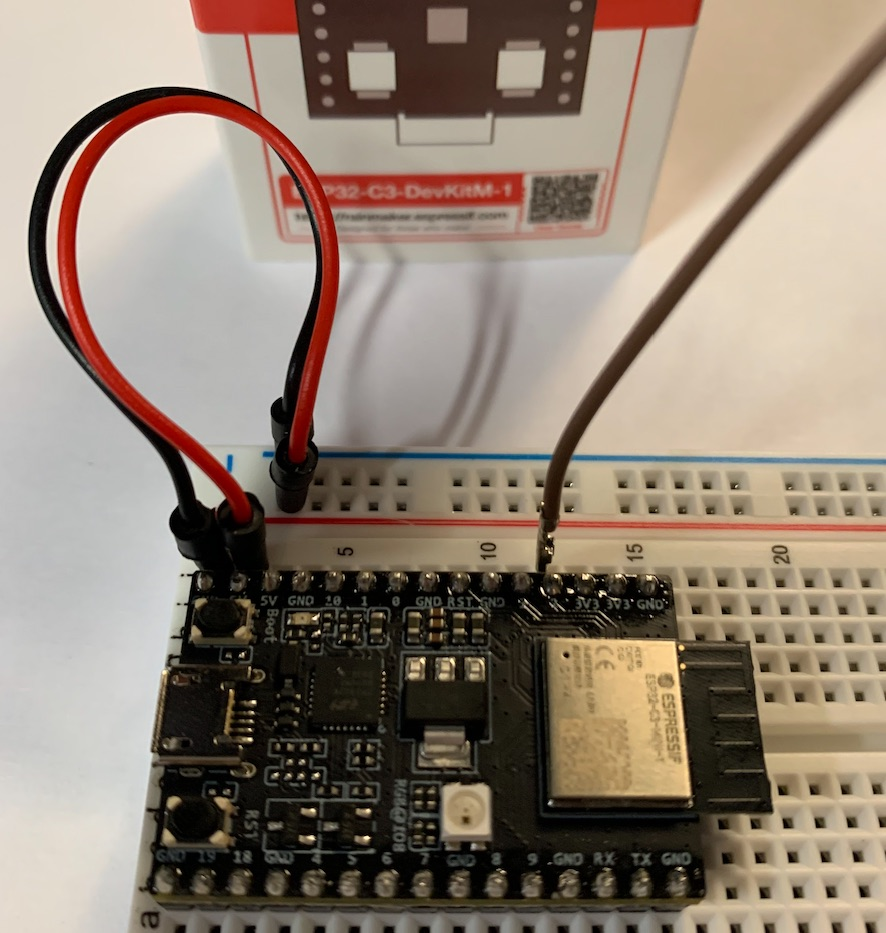

# ESP32-C3 Rainbow LED Strip

This is an example of how to use the Espressif ESP32-C3-DevKitM-1 to drive a WS2812B-64 Led Strip. The  [WS2812](http://www.world-semi.com/Certifications/WS2812B.html) is a digital RGB LED which integrates a driver circuit and a single control wire. This example will illustrate how to drive an WS2812B-64 LED strip but can be easily adopted to drive a led strip of a different size.

[](https://youtu.be/IrDMmVUumLg)

video example

## How to Use Example



### Hardware Required

* A development board with an ESP32 SoC, in this case we are using the new ESP32-C3DevKitM1
* A USB cable for Power supply and programming
* A WS2812 LED strip

Connection :

```
                             --- 5V
                              |
                              +
GPIO2 +-----------------+---|>| (WS2812B-64)
                        DI    +
                              |
                             --- GND
```

### Configure your computer

This presumes some version of Linux or MacOS with dev tools installed and a python version 3.8 (as of now 3.9 will not work). Details can be found [here](https://docs.espressif.com/projects/esp-idf/en/latest/esp32/get-started/#step-1-install-prerequisites)

#### ESP-IDF Setup
mkdir -p ~/esp
cd ~/esp
git clone --recursive https://github.com/espressif/esp-idf.git
cd ~/esp/esp-idf
./install.sh
. $HOME/esp/esp-idf/export.sh

#### Demo Setup
cd ~/esp
git clone https://github.com/cashoefman/esp32-c3-rainbow-led-strip.git

Open the project configuration menu (`idf.py menuconfig`). 

In the `Example Connection Configuration` menu:

* Set the GPIO number used for transmitting the IR signal under `RMT TX GPIO` optin. (Default is 2)
* Set the number of LEDs in a strip under `Number of LEDS in a strip` option. (Default is 64)

### Build and Flash

Run `idf.py set-target esp32c3` to set the target for compilation to the ESP32-C3
Run `idf.py flash monitor` to build, flash and monitor the project.

To exit the serial monitor, type ``Ctrl-]``.

## Hardware Setup

Connect the `Input` signal of WS2812B-64 LED strip to the GPIO you set in menuconfig and connect power to the Led Strip.

When you run the example, you will see a rainbow effect. To change the speed, you can update the `EXAMPLE_CHASE_SPEED_MS` value in `led_strip_main.c` file.
